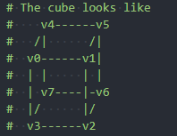
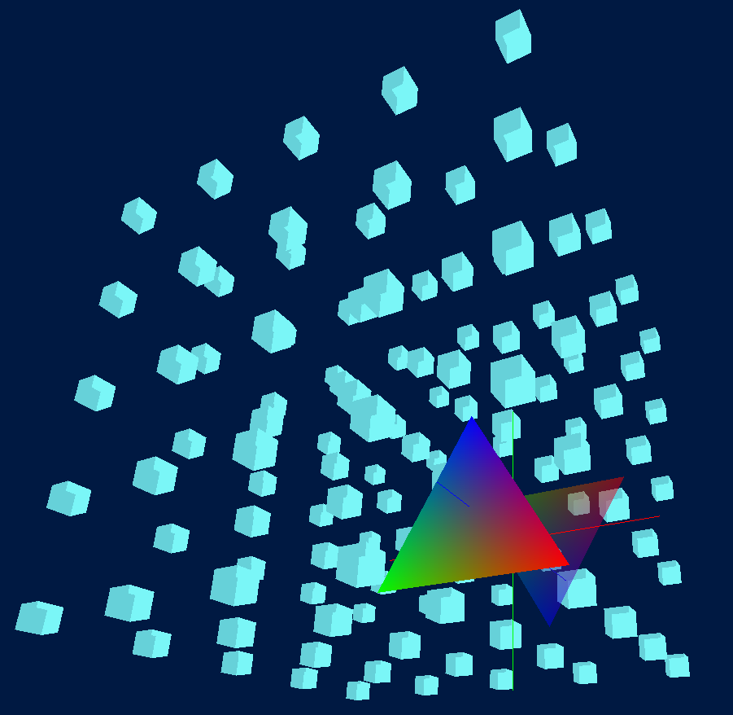

# CT Display Project

The aim is to display CT volume in 3D space.

## Draw 3D Volume

The 3D Volume is drawn as bricks.
The brick of single voxel is

A simple demo is

## History

-   2021-12-16

    -   Start the project.
    -   Write several basic examples of pyOpenGL.

-   2021-12-17

    -   Develop Basic pyOpenGL methods.

-   2021-12-19

    -   Render both side of one plane.

-   2021-12-21

    -   Start Dash display.

-   2021-12-22

    -   Built the demo of displaying the 3D volume of CT Image;
    -   The images are rendered in slice views;
    -   The images are also calculated to detect the target.

-   2021-12-24

    -   Add 3D contour view.

-   2021-12-28

    -   Add example for features computation using `radiomics` package;
    -   Develop new DCM files manager;
    -   Apply logging system;
    -   Develop feature computing functional.
